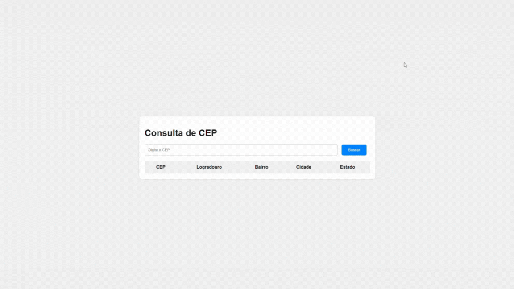

# Consulta de CEP

Esta é uma aplicação simples que permite ao usuário consultar informações de CEP utilizando a API pública do ViaCEP. Ao digitar um CEP válido e clicar no botão "Buscar", as informações correspondentes são exibidas em uma tabela na página.

## Funcionalidades

- Busca de informações de CEP utilizando a API do ViaCEP.
- Exibição das informações em uma tabela na página.

## Como usar

1. Abra o arquivo `index.html` em seu navegador.
2. Digite o CEP desejado no campo de busca.
3. Clique no botão "Buscar" para obter as informações do CEP.

## Exemplo de Uso

## Tecnologias Utilizadas

- HTML5
- CSS3
- JavaScript

## Autor

Rennan Allen

